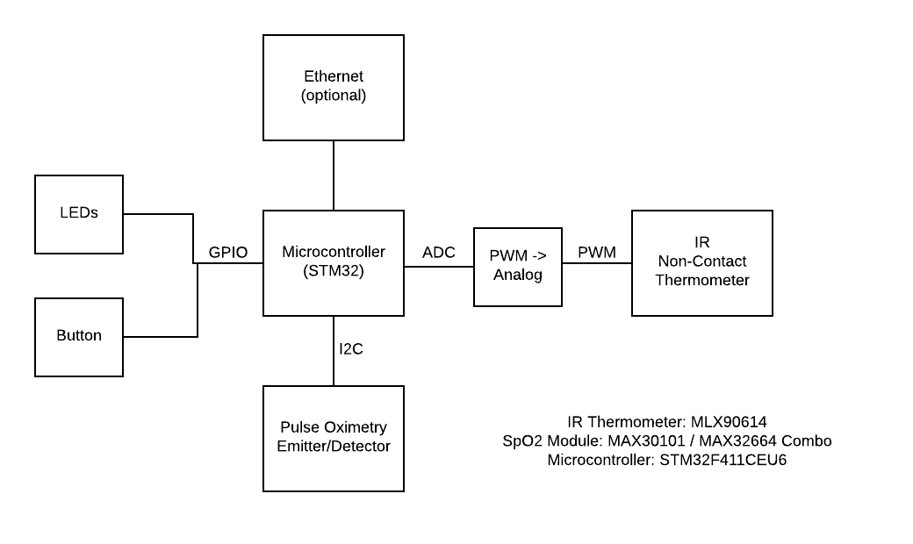

# Invent an 'Imaginary' Embedded System

Vital signs monitors are a common embedded system in varying degrees of complexity. Hospital grade units use EKG leads and sophisticated algorithms to visualize the patient's cardiac activity and derive many vital stats. More recently, the invention of a relatively simple optical sensor with two wavelengths has allowed pulse rate to be easily and inexpensively measured by microcontroller based systems via pulse oximetry. These systems can measure SpO2 and derive pulse rate. More sophisticated algorithms can compute heart rate variability, which can be used for biofeedback in athletic performance and stress management through breath control. 

Much as SpO2 measurement can now be done with an integrated, relatively low cost sensor, non-contact temperature measurement sensors exist also. They use Infrared wavelengths to derive a quantity that can be communicated via PWM indirectly or I2C directly. 

An embedded system could be built using these two relatively low cost, high integration sensors to measure SpO2 and non-contact temperature at the same time. This would provide a means of contributing to an assessment whether a person had CoVID-19. This device could also be used to assess more conventional illnesses such as the flu. Lastly, as an advanced feature, machine learning techniques could be used to fuse and process the measurements and give a high level assessment of greater accuracy and/or meaning to the user. 

This system would be more useful with integration of a BLE-enabled microcontroller, like the Nordic NRF52840, which would allow communication of metrics to a smartphone app. This is slightly beyond the scope of the system described here, but would be a valuable add. 

Pictured below is a block diagram of the system. 

