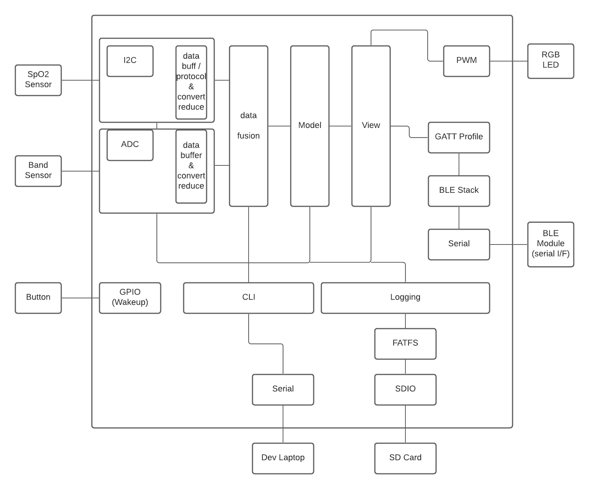

# Software Block Diagram: invent an embedded system

The Software Block diagram below depicts a device that measures heart rate variability; and has a training function to allow the user to develop their skill at maniuplating heart rate variability through breathing. The emergent science of heart rate variability measurement serves to help athletes improve their performance, and also, perhaps more importantly, can help train people to time their breathing so as to have a heart rate variability that engages the parasympathetic nervous system and helps lower anxiety. 

Because of the user interface requirements, the system uses a BLE interface to a Smartphone app, which is beyond the context of this drawing. 

The system uses two sensors: [1] an SpO2 sensor/controller and [2] a strain gauge (band sensor). The former measures SpO2, from which heart rate can be derived with an algorithm. The latter measures voltage drop across a band which is similar to a strain gauge in that the resistance varies as the band is stretched. The band is positioned near the user's lungs to measure inhalation/exhalation, and therefore derive breathing rate. 

An RGB LED can be used as a user feedback device, and a button could be used to interact with the device and/or wakeup the device from deep sleep. 

There are quite a number of subsystems that are perhaps oversimplified. There is a layer I call "data fusion", which combines the results of the SpO2 sensor and band sensor. It is probably similar to the "Model" component, and the two could probably be combined. The "View" component is meant to convey training to the user in the form of either LED brightness or GATT protocol variables over Bluetooth to the smartphone app. 

I have put both CLI and Logging here. The CLI is a development stage interface that let's callbacks be registered in various components to let the developer interact with components, whereas the log is output to an SD card in this example. It could be output to another serial port or over BLE.

