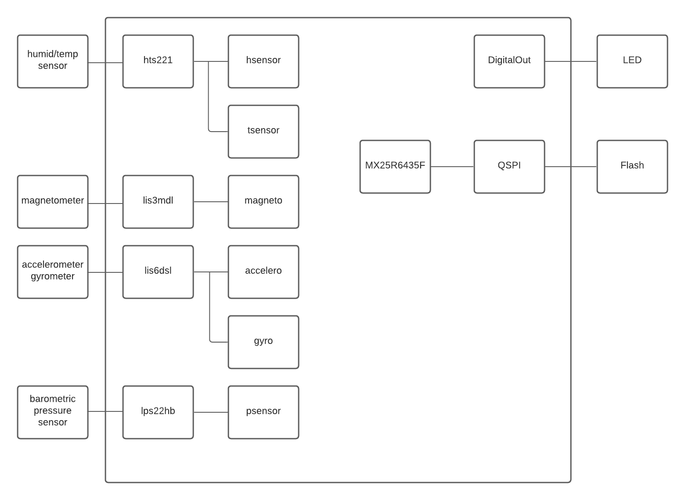

# Analyze MBED boilerplate code

Part two of the assignment this week was to pick a processor that roughly matches the requirements that you envisage for the final project. Generate code from one of the code examples (if there are any), and put together a Software diagram for this processor.

From my submission for part 1 of this assignment, I was looking for an STM32 processor with BLE. This produced 5 results [here](https://os.mbed.com/platforms/?q=&Communication=BLE&Target+vendor=STMicroelectronics), of which I picked the [Disco L475E](https://os.mbed.com/platforms/ST-Discovery-L475E-IOT01A/) because it was the only one with a number of examples. 

I was somewhat disappointed with the example templates in that the Bluetooth LE oriented ones merely published fake data (not from a sensor), and the onboard sensor example just printed out the values and did nothing with them. 

I selected the onboard sensor readings, since this seemed to involve interaction with the hardware. The BLE samples just setup the GATT profile and published fake data. 

Below is the diagram for the program. 

