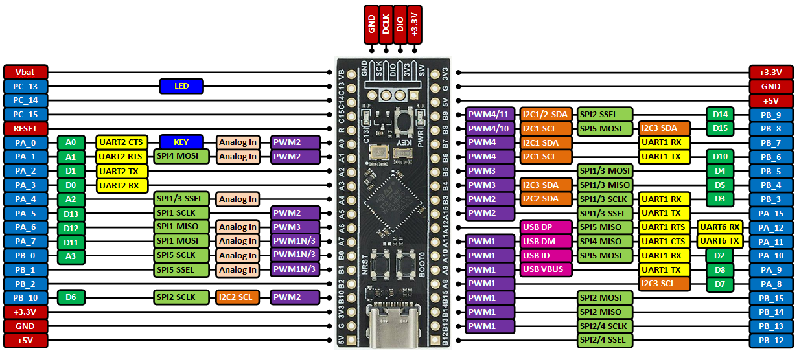

### What eval board did you choose and why

I chose the STM32F411 board from WeAct Studio similar to the Blue Pill. 

I wanted something like the Blue Pill only updated with an F4 processor. This has the same processor as the ST Nucleo F411 board. 

Most peripherals are brought out to pins. Pin muxing will be a slight challenge, but one that I think can be overcome. Serial busses are relatively low speed, so the breadboard friendliness of this board should be useful. This was also a reason for choosing it -- since I wanted to use two peripheral chips that are not standard on ST eval boards, I wanted something breadboard friendly. 

### What kind of processor is it?

[STM32F411CEU6](https://www.st.com/en/microcontrollers-microprocessors/stm32f411ce.html)

### How much Flash and RAM does it have? Any other memory types?

512 KB of flash, 128 KB of SRAM

### Does it have any special peripherals? (List 3-5 that you noted as being interesting.)

USB full speed client. I may try and write a simple HID device if I have time. Otherwise standard communications: SPI, I2C, USART

FreeRTOS is fully supported for the F411 and integrated into CubeIDE 

### Does it have a floating point unit?

Standard ARM FPU and DSP instructions

### If it has an ADC, what are the features?

1×12-bit, 2.4 MSPS A/D converter: up to 16 channels

