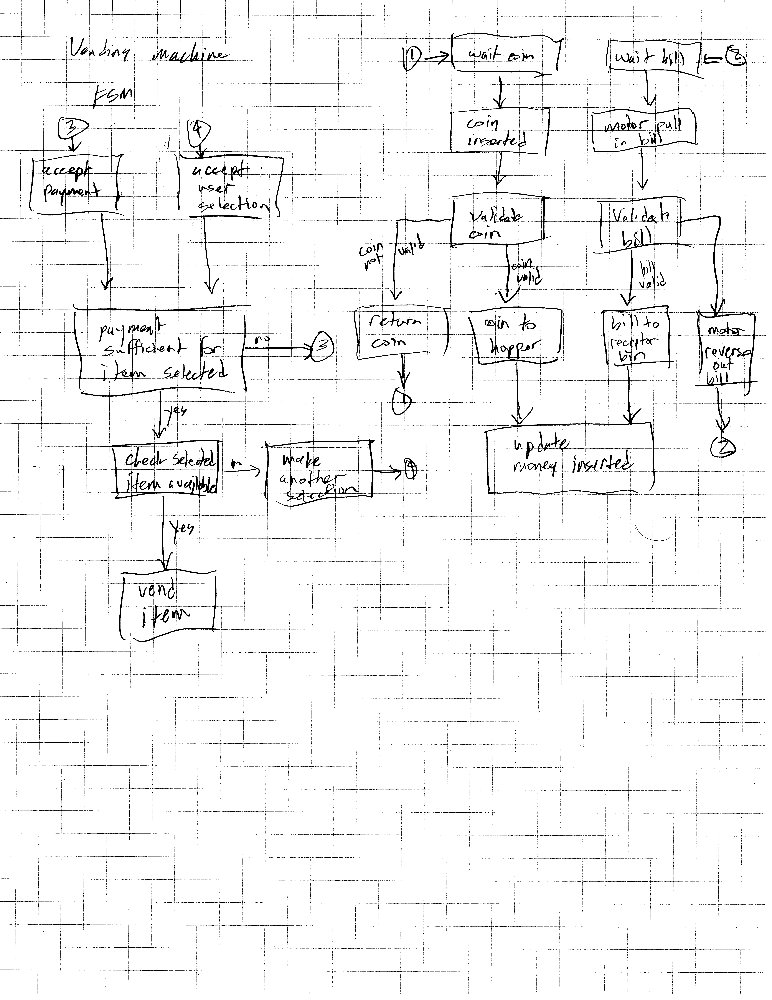

### Week 7 Homework

I've had a couple of questions involving 'design this', which implied, at least to me, begin with a state diagram. One was to design an elevator, another a vending machine. I'll choose the vending machine here.

To start off, make the simplifying assumption that you can issue the 'vend' command to another controller with it's own state machine that is responsible for dispensing (vending) the product. In that case, there are two sources of input that the state machine must be concerned with: one is the product selector, and the other is the payment acceptor (used to be bill/coin). We will ignore the credit card acceptor for now, but this could be reduced to an input signal similar to a bill or coin acceptor. 

There are 3 separate state machines, one for each acceptor (bill/coin), and another overall state machine which includes the users product selection. I've drawn out the state machines below. 

